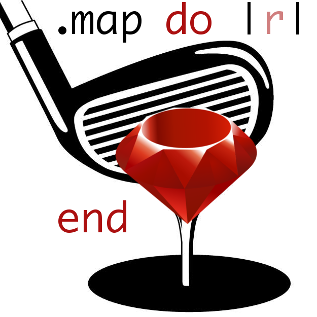

# INTRODUCTION

This set of markdown documents is designed to act as a collection of advice and techniques for the recreational programming activity of code-golf, focusing primarily on the Ruby language.

Though these documents are intended to be an introduction to code-golf in Ruby, it is assumed that the reader already has some knowledge of the Ruby language and as such, will not be covering the basics of Ruby. To learn more about Ruby, the [Ruby language website](https://www.ruby-lang.org/en/) is the best starting point.

Despite the majority of the tips here being focused towards Ruby, some advice does apply to code-golfing in general, and may prove to be useful for learning to golf in other languages too.

## What is code-golf?

As explained briefly on [Wikipedia](https://en.wikipedia.org/wiki/Code_golf):

>**Code golf** is a type of recreational computer programming competition in which participants strive to achieve the shortest possible source code that implements a certain algorithm.

Code-golf has gained a lot of popularity primarily due to the [code-golf section on StackExchange](https://codegolf.stackexchange.com/), though you can also find other smaller code-golf communities such as *the relatively dead* [/r/CodeGolf](https://www.reddit.com/r/codegolf/).

## Measurements

Code-golf solutions are typically measured in **bytes**. The aim is to have a solution with the fewest number of bytes.

Though some programming languages allow you to use other encodings, [UTF-8](http://www.fileformat.info/info/unicode/utf8.htm) is regarded as the standard. Note that UTF-8 uses 1 to 4 bytes per character. 

For example, consider the characters `a`, `﷽` and `𠜎` which are all Unicode characters, but when represented as UTF-8 codepoints, they use 1, 3 and 4 bytes respectively.

All of the [ASCII characters](http://www.asciitable.com/) use only 1 byte, so these will be the most valuable in code-golf for things like variable names.

## Rules

Though there is no official standard set of rules for code-golf, your solution:

- Should aim to consist of the fewest amount of bytes possible
- Can use any form of I/O provided it is reliable and consistent
- Can be written in any programming language

Other rules may be further specified by the issuer of the code-golf problem, for example `No leading or trailing whitespace allowed`, or `No use of imported libraries`.

The Ruby version to use is a choice that you should make. There will be some tricks that work in older versions of Ruby that won't work in newer versions, and vice versa.

## Useful tools

Although it's perfectly fine to develop a code-golf solution on your own, just by experimentation, there are a number of tools that you may find useful in assisting you to come up with a solid code-golf solution:

- [Rubular](http://rubular.com/) - a Ruby regular expression editor, handy for testing strings against regular expressions as you write them.
- [Ruby documentation](http://ruby-doc.org/) - the official documentation for the Ruby language and its standard library.
- [UTF-8 string length counter](https://mothereff.in/byte-counter) - a simple application for counting the bytes in a UTF-8 string if you can't tell by looking/counting, or don't want to guess. Better safe than sorry!
- [Interactive MRuby]() - note that MRuby is a separate implementation of the Ruby language, although its syntax is Ruby 1.9 compatible. Though I recommend just using IRB in your terminal, you can use this too.

---

# CONTENTS

1. [General](/articles/General.md) - General tips and advice for code-golf, including common (**non-language specific**) code-golf techniques.
2. [Methods, blocks and lambdas](/articles/Methods,%20blocks%20and%20lambdas.md) - The different ways in which executable code can be stored and called, and which way is best for code-golf.
3. [IO, Kernel and ARGV](/articles/IO,%20Kernel%20and%20ARGV.md) - How to handle input and output for the given code-golf problem.
4. [Strings, symbols and regular expressions](/articles/Strings,%20symbols%20and%20regular%20expressions.md) - Quick tips such as interpolation to cut down on bytes wherever strings are involved, and understanding search patterns and the `Regexp` class.
5. [Math and numerics](/articles/Math%20and%20numerics.md) - Deciding which type of numeric to use, how to declare them, and general advice for any math involved in golfing.
6. [Arrays, ranges and the splat operator](/articles/Arrays,%20ranges%20and%20the%20splat%20operator.md) - Techniques for array and range manipulation and optimization, and understanding the Ruby splat operator.

---

**Authors**: 

[eonu](https://github.com/eonu) - Edwin Onuonga